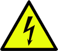
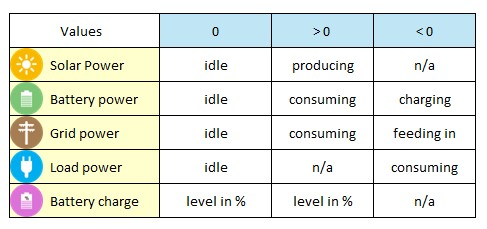
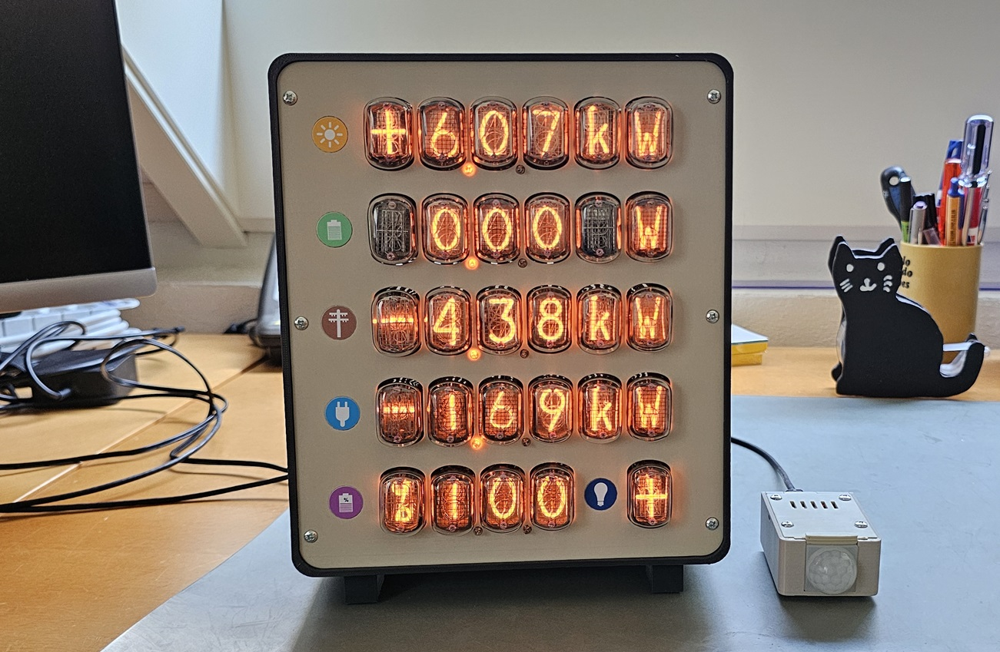

# Nixie Solar Power Flow Monitor
## This repository contains some information and ideas for building a nixie solar power flow monitor.

## WARNING: nixies need high voltage to light up. If you choose to build or use the device, you are doing so at your own risk. 

**Notes:**
- **The firmware is designed to work with a specific Fronius hybrid inverter using the Solar API V1. Firmware changes are needed for other inverters and configurations.**
- **This repository does not contain a complete project design. The design of the high voltage power supply (170V / ≥75mA) is not provided. I recommend using a professionally designed and extensively tested HV PSU.** 
- **Be aware that I'm just an electronics hobbyist and nixie enthusiast. However, this repository is only intended for suitable qualified electronics engineers who are familiar with nixie tubes.**
- **Please read all documents in [Docs](Docs) before deciding whether to build the device.**
- **I'm not affiliated with any of the service providers mentioned in this project.**
  
**Status:** 
- Software: ready to be reviewed (beta)
- Hardware: ready to be reviewed (beta)

**Displayed Values:**

**Nixie tubes used in this project:**
- 15 x IN-12A or IN-12B
- 10 x IN-15A
- 4 x IN-15B

**Additional Features:**

- LED backlight
- Ethernet connection

**Nixie Solar Power Flow Monitor**

